<!-- TITLE -->
<h1 align="center">BULLSEYE APP 🎯🎯🎯</h1>

<!-- TABLE OF CONTENTS -->
### Table of Contents

* [About the Project](#about-the-project)  
* [Covered concepts](#covered-concepts)
* [How to play](#how-to-play)
* [Visual](#visual)
  * [Light Mode](#light-mode)
    * [Portrait](#light-mode-portrait)
    * [Landscape](#light-mode-landscape)
  * [Dark Mode](#dark-mode)
    * [Portrait](#dark-mode-portrait)
    * [Landscape](#dark-mode-landscape)
---
## About the project 

This is an iOS App for testing your accuracy on a Slider putting the Bullseye as close as you can from the value displayed. You can view your highest scores on the Leaderboard and also Reset the rounds and total score.
The design was based on [this Figma page](https://www.figma.com/file/3MBMeYd2hP4rajTbHnZL0z/Bullseye?node-id=0%3A1).

Built in Xcode 13 and it targets iOS 15.

---
## Covered concepts:

- Swift Basics
- Methods
- Strings
- Variables
- Type Inference
- SwiftUI Views
- SwiftUI View Modifiers
- SwiftUI State
- SwiftUI Bindings
- App Architecture
- Unit Testing
- Bug Fixes
- Developer Docs Usage
- Colors and Gradients
- Support for Dark Mode
- Extracting SwiftUI Views
- Filling and Stroking Shapes
- SFSymbols
- The Xcode Debugger
- The Environment Property Wrapper
- Size Classes
- Swift Arrays
- ScrollView
- App Icons
- Running on Physical Device

---

## How to play:

Drag the Bullseye Slider as close as you can to the number displayed. Then you can click on the <b>HIT ME!</b> button to check how many points you've scored. 
You can reset the total score tapping on the top left button or check the best scored points tapping on the top right button.
Have fun!

---

## Visual:

### Portrait (Light Mode):

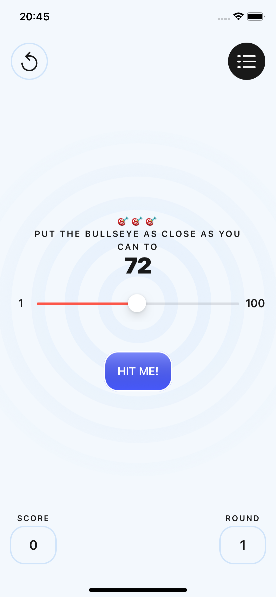
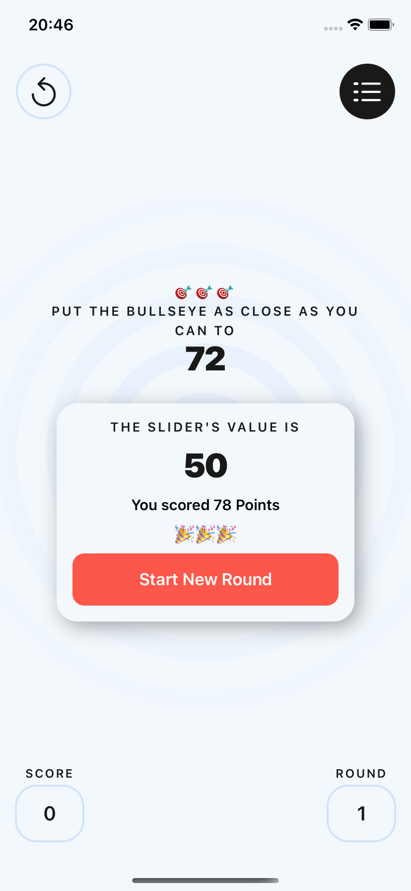
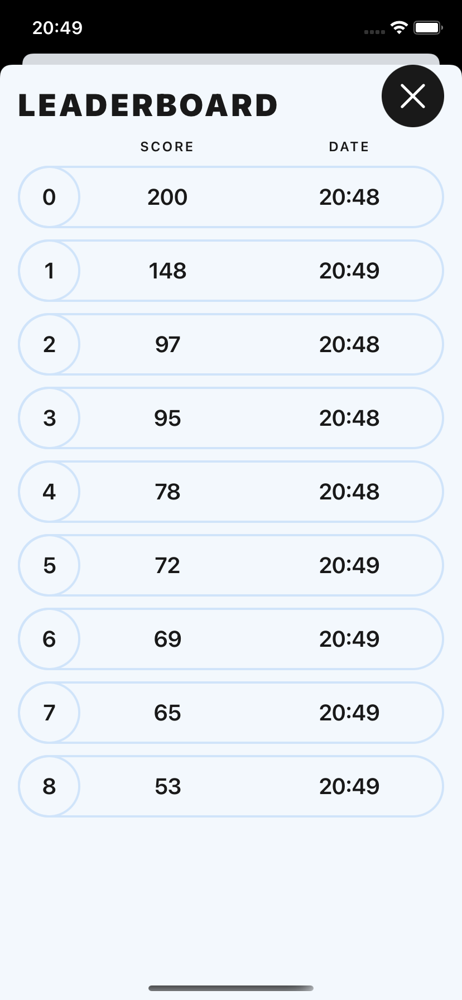

### Landscape (Light Mode):

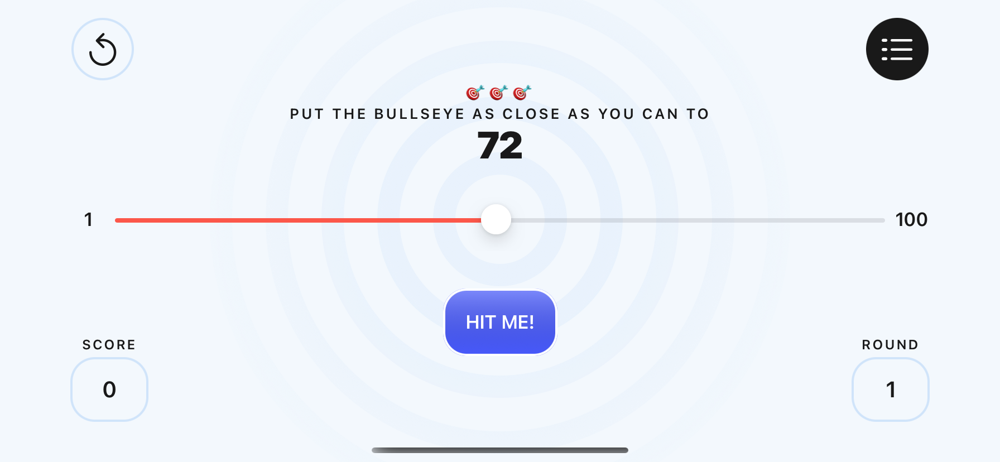
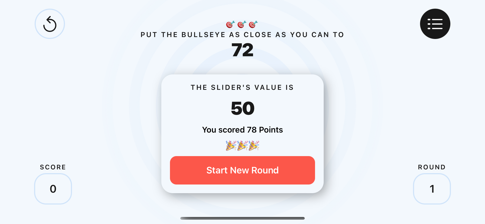
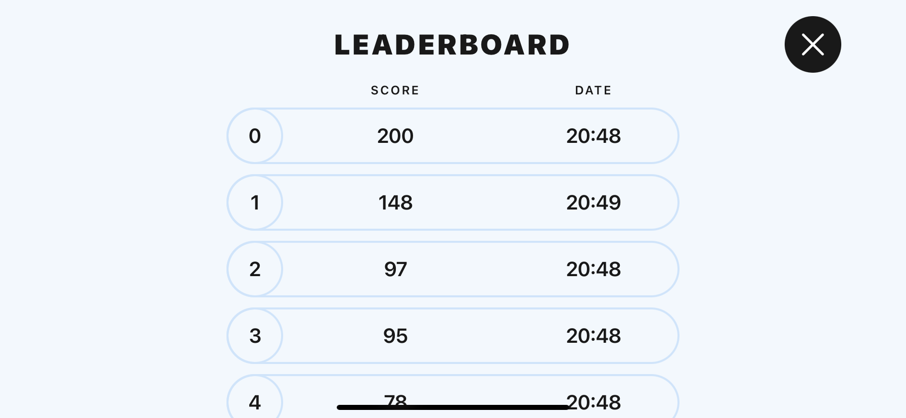

### Portrait (Dark Mode):

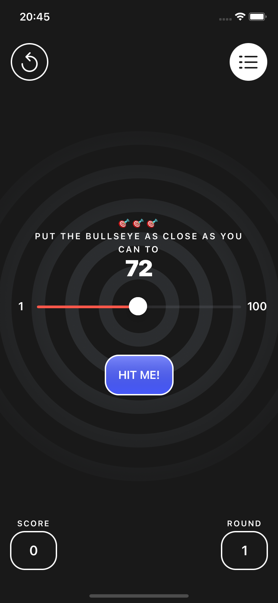
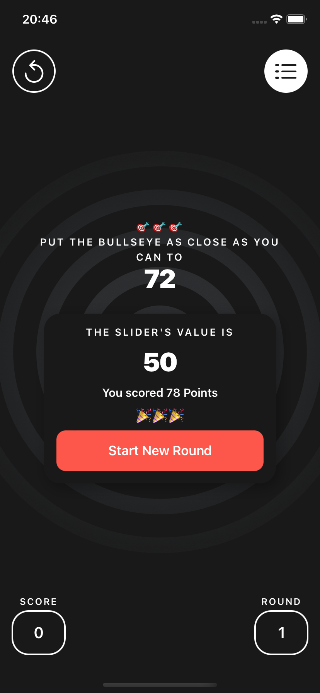
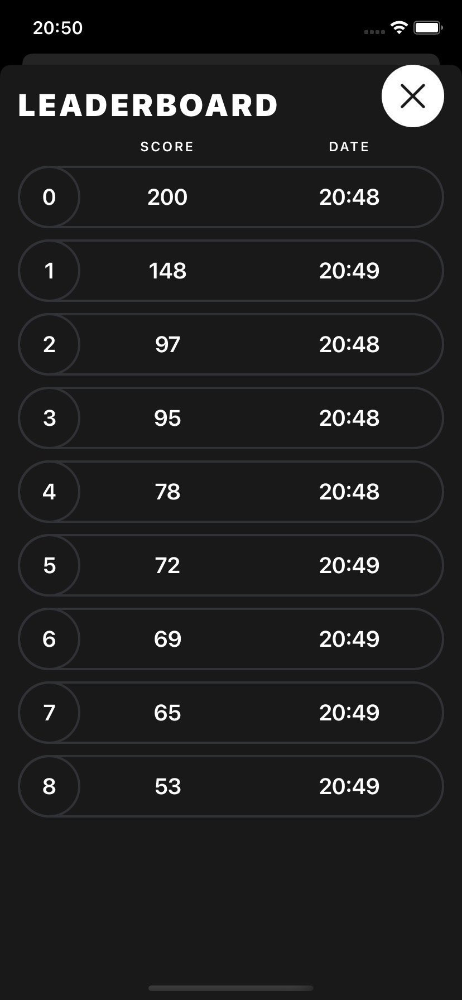

### Landscape:

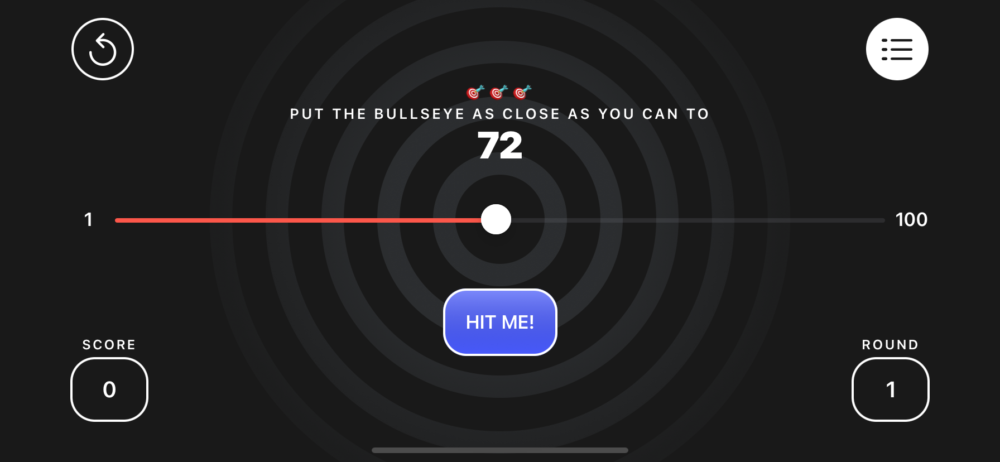
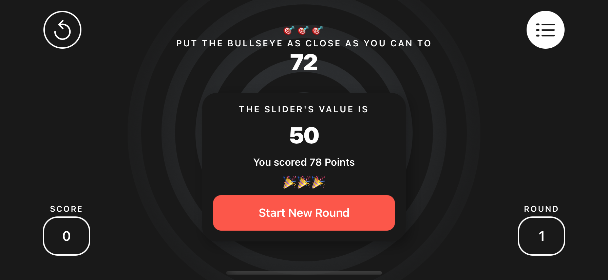
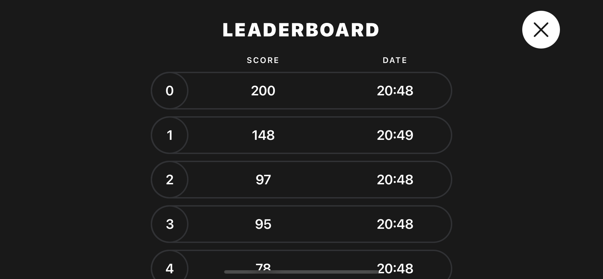